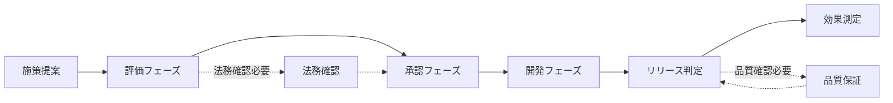

# ストリーミングサービス改善施策の業務分析

本リポジトリは、会員制ストリーミングサービスにおける改善施策の実施プロセスを、イベントストーミング手法を用いて分析した結果をまとめたものです。

## 概略フロー

## プロセスの特徴

1. **施策提案**
   - ビジネスオーナーまたは代理店からの提案
   - 会員増加とプレミアム会員への移行促進が目的

2. **評価プロセス**
   - 実現可能性、費用対効果の評価
   - 法令遵守、利用規約への適合性確認
   - 必要に応じて法務部への相談

3. **承認プロセス**
   - 開発費用1,000万円超の案件は上位組織承認
   - 利用実績のないパッケージ利用も上位組織承認
   - 条件付き承認時は再フィージビリティスタディ

4. **開発プロセス**
   - 要件定義、設計、実装の各フェーズ
   - 品質基準への適合性確認
   - 必要に応じて品質保証部レビュー

5. **効果測定**
   - IRR 5%以上が基準
   - 3ヶ月以内に報告必要
   - 追加施策検討の起点

## イベントストーミング分析の詳細

### 基本ステップ
1. [業務イベントの抽出](event-storming-step1.md)
2. [イベントの時系列整理](event-storming-step2.md)
3. [問題点の洗い出し](event-storming-step3.md)
4. [転換イベントの特定](event-storming-step4.md)
5. [コマンドの特定](event-storming-step5.md)

### 発展ステップ
6. [自動化ポリシーの定義](event-storming-step6.md)
7. [読み取りモデルの特定](event-storming-step7.md)
8. [外部システムの追加](event-storming-step8.md)
9. [集約の定義](event-storming-step9.md)
10. [バウンデッド・コンテキストの設定](event-storming-step10.md)

## 詳細フロー
詳細な業務フローについては[こちら](business-flow.md)を参照してください。

## 分析結果の活用

本分析結果は以下の用途での活用を想定しています：

1. **業務改善**
   - プロセスのボトルネック特定
   - 自動化可能領域の特定
   - 部門間連携の最適化

2. **システム化要件**
   - 自動化ポリシーの実装
   - 外部システム連携の設計
   - データモデルの設計

3. **組織体制**
   - 役割と責任の明確化
   - 承認フローの最適化
   - コミュニケーションパスの整理

4. **ナレッジ管理**
   - 業務プロセスの文書化
   - 判断基準の標準化
   - ベストプラクティスの蓄積
