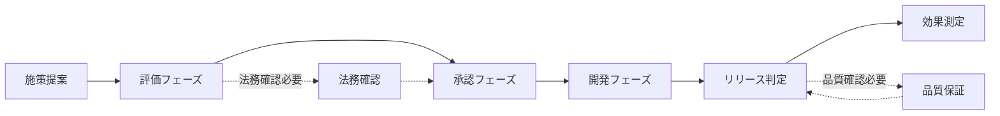
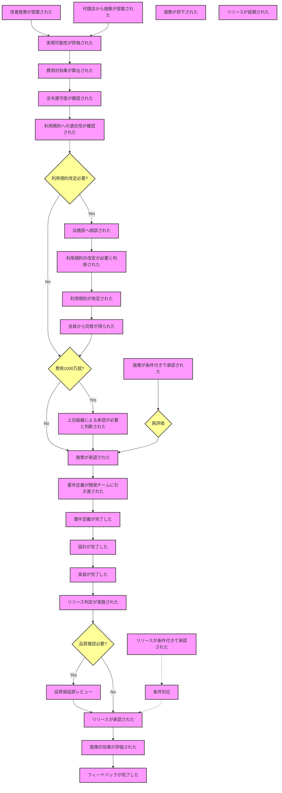

# ストリーミングサービス改善施策の業務フロー

## 概略フロー

## 詳細フロー

## 備考

### 概略フローの特徴
- 6つの主要フェーズで構成
- 法務確認と品質保証は代替パスとして表現
- フェーズ間の基本的な流れを明示

### 詳細フローの特徴
1. **提案フェーズ**
   - ビジネスオーナーまたは代理店からの提案を起点

2. **評価フェーズ**
   - 実現可能性、費用対効果、法令遵守、利用規約適合性を評価
   - 利用規約改定の要否を判断

3. **法務確認フェーズ**
   - 必要に応じて法務確認を実施
   - 利用規約改定と会員同意取得のプロセスを含む

4. **承認フェーズ**
   - 費用規模による承認ルートの分岐
   - 条件付き承認時の再評価ループを含む

5. **開発フェーズ**
   - 要件定義から実装までの一連の流れ
   - 各工程の完了を明確に定義

6. **リリース判定フェーズ**
   - 品質保証部レビューの要否判断
   - 条件付き承認時の対応ループを含む

7. **効果測定フェーズ**
   - 効果評価とフィードバックのプロセス
