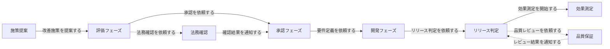
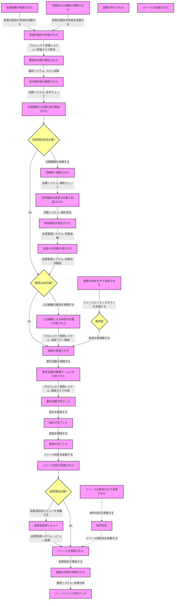

# ストリーミングサービス改善施策の業務フロー

## 概略フロー

## 詳細フロー

## 備考

### 概略フローの特徴
- 6つの主要フェーズで構成
- 主要なコマンドをエッジ上に表示
- 代替パスのコマンドも明示

### 詳細フローの特徴
1. **コマンドの表現**
   - エッジ上に青字でコマンドを表示
   - 主要な業務指示や依頼を明示

2. **システム連携の表現**
   - エッジ上に緑字でシステム連携を表示
   - 具体的な連携内容を記載

3. **判断フローの明確化**
   - 黄色の判断ノードで分岐を表現
   - 判断基準を明示

4. **代替パスの表現**
   - 点線で条件付きフローを表現
   - 再評価ループの明示

5. **外部システムとの連携**
   - プロジェクト管理システム
   - 会員管理システム
   - 法務システム
   - 品質管理システム
   - 基幹システム
