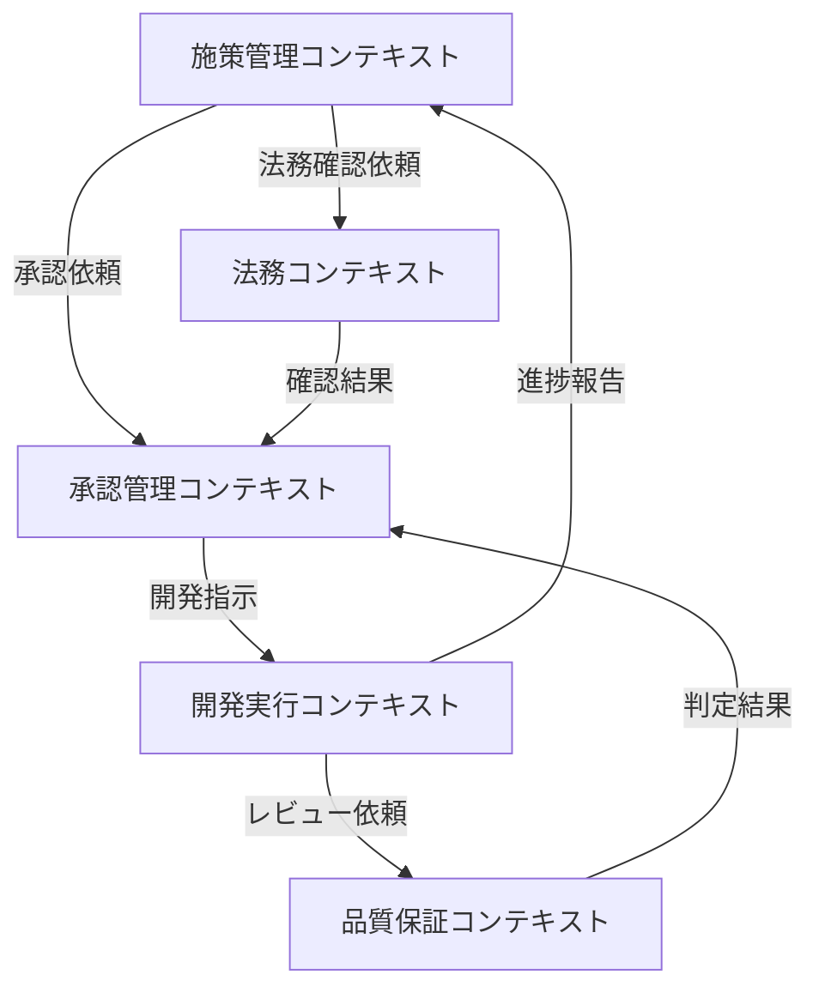

# イベントストーミング - Step10: 区切られた文脈に分割する

## バウンデッド・コンテキストの定義
機能的に密接に関係する集約をグループ化し、明確な境界を持つ文脈として定義します。

### 1. 施策管理コンテキスト

#### 主管
- 開発部門

#### 含まれる集約
- 施策パッケージ集約
- 効果測定集約

#### 責任範囲
- 施策の提案管理
- 施策間の依存関係管理
- 効果測定の実施と評価
- 部門間調整の統括

#### 外部との関係
- 承認管理コンテキストへの承認依頼
- 法務コンテキストとの連携調整
- 品質保証コンテキストとの連携調整

### 2. 承認管理コンテキスト

#### 主管
- 開発部門（承認機能担当）

#### 含まれる集約
- 承認管理集約

#### 責任範囲
- 承認プロセスの管理
- 承認状態の追跡
- 条件付き承認の管理
- 承認履歴の保持

#### 外部との関係
- 施策管理コンテキストからの承認依頼受付
- 開発実行コンテキストへの承認結果通知
- 各コンテキストへの承認状態の共有

### 3. 法務コンテキスト

#### 主管
- 法務部門

#### 含まれる集約
- 法務確認集約

#### 責任範囲
- 法務確認の実施
- 利用規約改定の管理
- 会員同意の管理
- 法的リスク評価

#### 外部との関係
- 施策管理コンテキストからの確認依頼受付
- 承認管理コンテキストへの確認結果通知
- 会員管理システムとの連携

### 4. 開発実行コンテキスト

#### 主管
- 開発部門（開発チーム）

#### 含まれる集約
- 開発管理集約

#### 責任範囲
- 要件定義の実施
- 設計・実装の管理
- 品質基準への適合確認
- 成果物の管理

#### 外部との関係
- 承認管理コンテキストからの開発指示受付
- 品質保証コンテキストとの連携
- 施策管理コンテキストへの進捗報告

### 5. 品質保証コンテキスト

#### 主管
- 品質保証部門

#### 責任範囲
- 品質基準の定義
- 品質レビューの実施
- 品質メトリクスの測定
- リリース判定支援

#### 外部との関係
- 開発実行コンテキストからのレビュー依頼受付
- 承認管理コンテキストへの判定結果通知
- 品質データの全コンテキストへの共有

## コンテキストマップ

## 境界の特徴
1. **組織構造との整合**
   - 各部門の責任範囲を反映
   - 組織分掌に基づく明確な境界

2. **プロセスの一貫性**
   - 開発部門による一気通貫の管理
   - 独立部門との明確なインターフェース

3. **データの整合性**
   - コンテキスト内での強い整合性
   - コンテキスト間の疎結合維持

## 備考
- 各コンテキストは独自の用語体系を持つ
- コンテキスト間は明確に定義されたインターフェースで連携
- 主管部門が全体のプロセスを統括
- 実際のイベントストーミングでは、コンテキストは大きな枠で表現することが一般的
