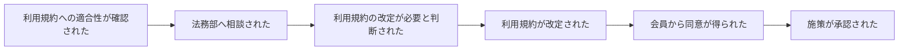
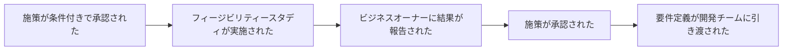
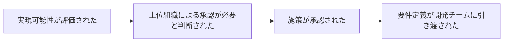
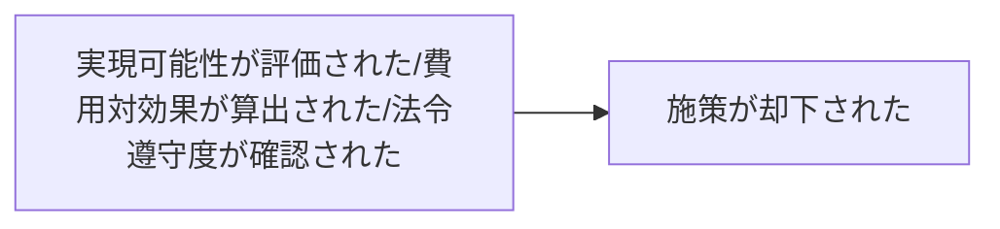
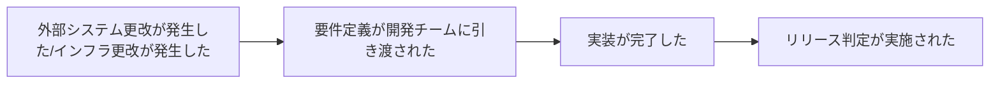

# イベントストーミング - Step2: 時系列に並べる

## 正常系シナリオ
時系列に沿って、最も一般的なフローを整理します。

```mermaid
graph LR
    提案["改善施策が提案された"]
    --> 実現可能性["実現可能性が評価された"]
    --> 費用対効果["費用対効果が算出された"]
    --> 法令遵守["法令遵守度が確認された"]
    --> 規約適合["利用規約への適合性が確認された"]
    --> 承認["施策が承認された"]
    --> 要件定義["要件定義が開発チームに引き渡された"]
    --> 要件完了["要件定義が完了した"]
    --> 設計完了["設計が完了した"]
    --> 実装完了["実装が完了した"]
    --> リリース判定["リリース判定が実施された"]
    --> リリース承認["リリースが承認された"]
    --> 効果評価["施策の効果が評価された"]
    --> フィードバック["フィードバックが完了した"]
```

## 代替シナリオ1：利用規約改定が必要な場合

## 代替シナリオ2：条件付き承認の場合

## 代替シナリオ3：上位組織承認が必要な場合

## 代替シナリオ4：却下される場合

## 例外シナリオ：インフラ更改

## 備考
- 正常系シナリオは、最も一般的なフローを表現
- 代替シナリオは、条件分岐や例外的なケースを表現
- 実際のイベントストーミングでは、これらのイベントをオレンジ色の付箋紙で表現し、時系列に沿って左から右に配置
